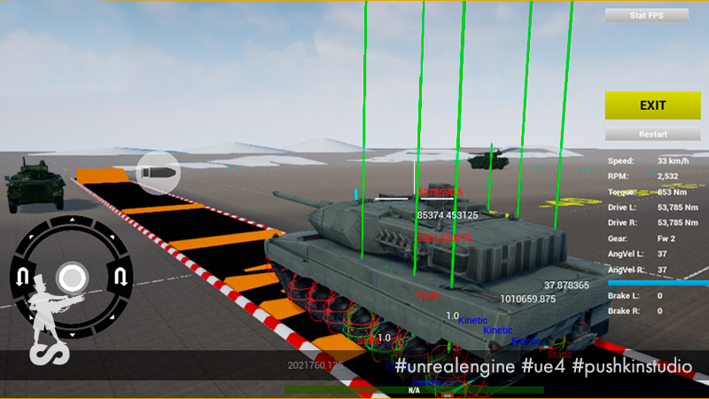

# PsRealVehicle

PsRealVehicle is the plugin for [Unreal Engine 4](https://www.unrealengine.com/) with simple force-driven vehicle simulation.

Check the [Wiki](https://github.com/PushkinStudio/PsRealVehicle/wiki) tab for plugin usage examples and installation notes.

The plugin is proudly used for [Armored Warfare: Assault](https://awa.my.com) development.

## Legal info

Unreal® is a trademark or registered trademark of Epic Games, Inc. in the United States of America and elsewhere.

Unreal® Engine, Copyright 1998 – 2016, Epic Games, Inc. All rights reserved.

